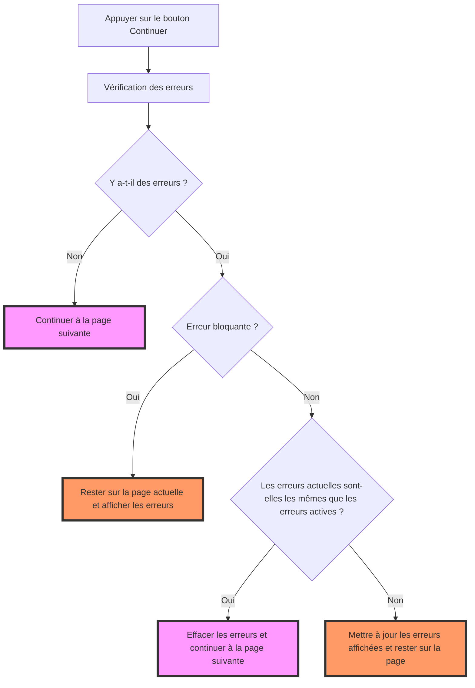

# Contrôles

Les contrôles permettent de définir des règles de validation dans le questionnaire (sous forme d'expression VTL). Ils sont [spécifiés dans Pogues](https://inseefr.github.io/Bowie/pogues/guide/) ou ajoutés automatiquement et exécutés par Lunatic. Stromae DSFR s'occupe simplement de piloter leurs exécutions.

Chaque contrôle possède les caractéristiques suivantes :

- Criticité : Peut être définie comme information, avertissement ou erreur.
- Type de contrôle : Peut être de format ou de cohérence.
- Expression : Définit la condition d'affichage du contrôle.
- Message d'erreur : Message affiché en cas de non-validation du contrôle.

Un contrôle est considéré comme **bloquant** s'il s'agit d'un **contrôle de format** ou si sa **criticité est erreur**.

## L'exécution des contrôles

L'exécution des contrôles est très liée à la pagination. En effet, ils sont exécutés à chaque clic sur le bouton **continuer**. L'impact des contrôles sur la pagination est détaillé dans le graphique ci-dessous :

## L'affichage

Sauf cas particulier (dans les tableaux, par exemple), les contrôles figurent désormais sous les champs de saisie. Les erreurs et avertissements sont affichés de la même façon.

Lorsque plusieurs contrôles ont été décrits, ils apparaissent avec une précédence (un contrôle doit être résolu avant que le suivant ne se déclenche).

Stromae DSFR se contente de piloter l’exécution des contrôles et de transmettre les erreurs aux composants affichés par Lunatic. La customisation de l’affichage des composants, et donc des contrôles, est gérée par Lunatic DSFR.
