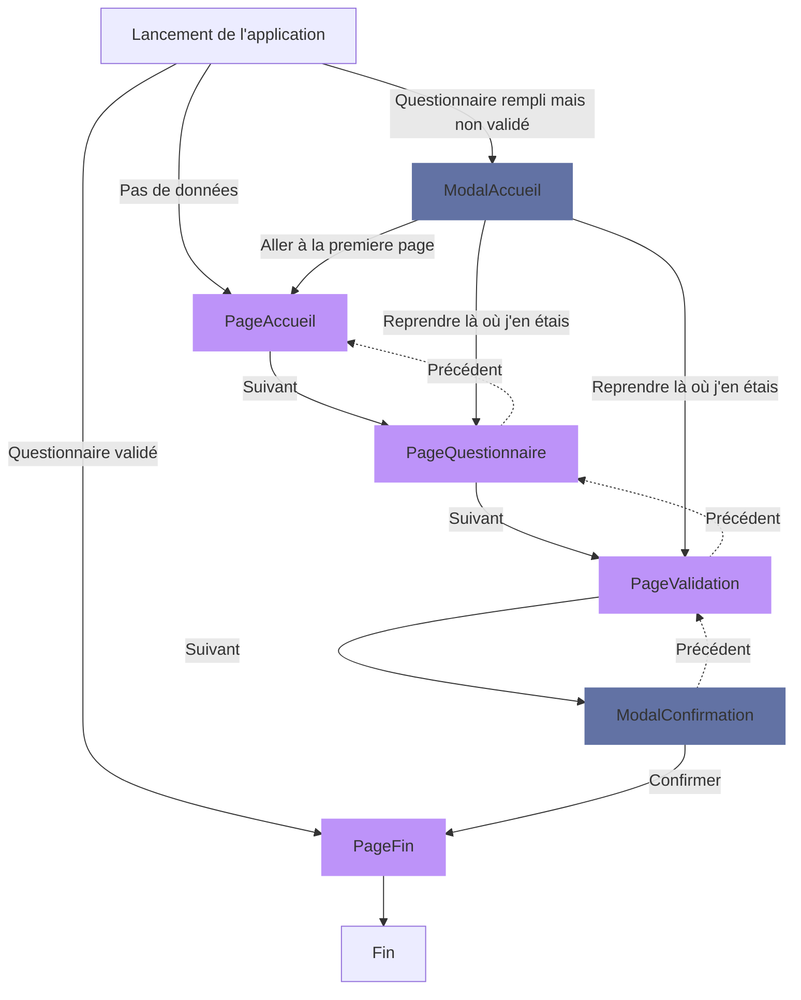

# Navigation

La navigation des pages est linéaire, a l'intérieur du questionnaire il existe toutefois un cas particulier le rond-point.

Ce diagramme explique la navigation entre les différentes pages de l'orchestrateur :

Pour en savoir plus sur la navigation dans le questionnaire, une [documentation lunatic est disponible](https://inseefr.github.io/Lunatic/docs/hook/navigation).

Le titre de chaque séquence est rappelé en haut du questionnaire.
